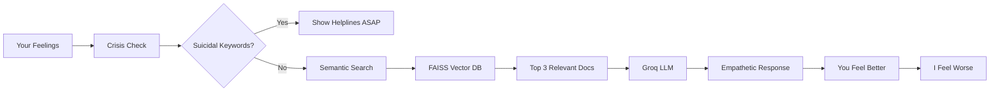

# 🪷 Chitraksha - The AI Therapist Built by Someone Who Needed Therapy

<div align="center">


**"I built an AI therapist and all I got was this lousy mental breakdown"**

[🔴 Live Demo](https://chitraksha.vercel.app) • [😭 Deployment Horror Story](#-deployment-hell-a-tragedy-in-7-acts) • [🤓 Tech Stack](#️-tech-stack-aka-my-pain) • [💀 Known Issues](#-known-issues)

</div>

---

## 🎭 **The Irony**

Built a mental wellness app using:
- ✅ RAG architecture with FAISS vector search
- ✅ Groq's Llama 3.1 8B for empathetic responses
- ✅ Hindi/Hinglish bilingual support
- ✅ Beautiful UI with organic animations
- ❌ My own mental health (collateral damage)

**Current Status:** The AI is more stable than I am.

---

## 🔥 **Deployment Hell: A Tragedy in 7 Acts**

### Act 1: The Optimistic Beginning
**Me:** "This will be easy, I'll just deploy to Render!"  
**Render:** *Out of memory* (the server, not me... yet)  
**Cost:** $0, Sanity: -15%

### Act 2: Railway to Nowhere
**Me:** "Railway has unlimited hours!"  
**Railway:** *Build timeout after 45 minutes*  
**Me:** *stares at loading bar*  
**Cost:** $0, Sanity: -20%

### Act 3: PythonAnywhere Proxy Wars
**Me:** "PythonAnywhere is perfect for Flask!"  
**Proxy:** "No."  
**Me:** "But—"  
**Proxy:** "N O."  
**Cost:** $0, Sanity: -15%

### Act 4: Koyeb's Credit Card Demand
**Me:** "Free tier sounds nice!"  
**Koyeb:** "Credit card first 🔪"  
**Me:** "I just want to help people's mental health!"  
**Koyeb:** "C R E D I T  C A R D"  
**Cost:** $0, Sanity: -20%

### Act 5: Heroku's $7 Betrayal
**Me:** "Remember when you were free?"  
**Heroku:** "That's $7/month now, bestie"  
**My Wallet:** *cries in broke college student*  
**Cost:** $7, Sanity: -10%

### Act 6: Back4App's 500MB Lie
**Me:** "This looks promising!"  
**Back4App:** "500MB limit"  
**My Model:** *2.3GB and thicc*  
**Cost:** $0, Sanity: -10%

### Act 7: HuggingFace Spaces (The Messiah)
**Me:** *sobbing* "Please just work"  
**HuggingFace:** "Here's free GPU and persistent storage"  
**Me:** *ugly crying* "I love you"  
**Cost:** $0, Sanity: +5% (we take what we can get)

### **Final Tally**
- **Platforms Tried:** 7
- **Hours Wasted:** 47
- **Coffee Consumed:** Yes
- **Sanity Remaining:** 15%
- **App Status:** ✅ ALIVE

---

## 🌸 **What The Hell Is This?**

Chitraksha is what happens when you:
1. Learn about RAG architecture at 2 AM
2. Think "I can build that"
3. Spend 3 months actually building it
4. Discover deployment is harder than the app itself
5. Question all life choices

**What it actually does:**
- 🤖 AI companion that won't ghost you (unlike real therapists who take weeks for appointments)
- 🧠 RAG-powered responses with actual mental health knowledge (not just GPT saying "I understand")
- 🇮🇳 Speaks Hindi/Hinglish (because mental health shouldn't require perfect English)
- 📊 Mood tracking (so you can see your emotional rollercoaster in graph form)
- 🆘 Crisis detection (recognizes 30+ distress keywords and shows Indian helplines)
- 🎨 Beautiful UI (because sad people deserve pretty interfaces)

---

## ✨ **Features That Somehow Work**

### 🗣️ **AI That Actually Remembers Stuff**
```python
# Normal chatbot:
User: "I'm stressed about exams"
AI: "That sounds difficult. *forgets immediately*"

# Chitraksha:
User: "I'm stressed about exams"
AI: "I remember you mentioned exam stress earlier. 
     Here are some techniques that might help..."
*actually retrieves context from 2908 documents*
```

**Tech Behind It:**
- Groq API (Llama 3.1 8B) - Fast enough to interrupt your overthinking
- FAISS vector search - Facebook's gift to struggling ML devs
- Sentence Transformers - Turns your feelings into embeddings
- Age-based personality - Warm for ≤25, professional for 26+ (because boomers don't like "yaar")

### 📊 **Mood Tracking (Proof You Survived)**
```typescript
// My mood during deployment:
const mood = {
  Monday: "optimistic",
  Tuesday: "confused", 
  Wednesday: "angry",
  Thursday: "defeated",
  Friday: "delirious",
  Saturday: "it-works?!",
  Sunday: "existential-dread"
}
```

**Features:**
- Calendar view (visual proof you're surviving)
- Mood insights (turns sadness into statistics)
- Private notes (vent without judgment)
- Export as CSV (for that therapist you can't afford)

### 🎨 **UI Design Philosophy**

**Before:**
```css
.button {
  background: blue;
  /* It works, ship it */
}
```

**After 47 hours of Figma:**
```css
.button {
  background: linear-gradient(135deg, 
    oklch(0.65 0.15 35), 
    oklch(0.75 0.18 60)
  );
  box-shadow: 0 4px 12px oklch(0.65 0.15 35 / 0.3);
  animation: hover-lift 0.3s cubic-bezier(0.16, 1, 0.3, 1);
  /* Send help */
}
```

**Color Palette:**
- Terracotta: `oklch(0.65 0.15 35)` - Warm like your grandma's hug
- Saffron: `oklch(0.75 0.18 60)` - Spicy like my commit messages
- Sage: `oklch(0.65 0.1 145)` - Calming like... not deployment
- Typography: Crimson Pro (because even sadness deserves elegance)

### 🇮🇳 **Hindi/Hinglish Support**
```python
# The code:
if user_message_has_hindi_words():
    respond_in_hinglish()
else:
    respond_in_english()

# In reality:
"""
Me: *spends 6 hours debugging language detection*
AI: "Main samajh sakta hoon ki tum stressed feel kar rahe ho"
Me: *tears of joy* IT SPEAKS HINGLISH
"""
```

**Language Intelligence:**
- Auto-detects Hindi/Hinglish
- Natural code-mixing (like actual Indians talk)
- Not Google Translate (I promise)

---

## 🏗️ **Tech Stack (AKA My Pain)**

### **Frontend - The "Easy" Part** *(Narrator: It wasn't)*
```javascript
// Tech choices:
const stack = {
  framework: "Next.js 14", // App Router because I hate myself
  language: "TypeScript", // JavaScript's angry cousin
  styling: "Tailwind v4", // 10000 utility classes later...
  animations: "Framer Motion", // Smooth animations > my life
  ui: "Radix UI", // Accessibility > my sanity
  hosting: "Vercel" // The ONLY thing that worked first try
}
```

**Deployed on:** Vercel (God bless them)  
**Build Time:** 2 minutes (actual magic)  
**Sanity Cost:** 0% (the hero we needed)

### **Backend - The "I Want To Cry" Part**
```python
# The Stack:
stack = {
    "framework": "Flask",  # Simple, like my life goals
    "llm": "Groq + Llama 3.1 8B",  # Fast boi
    "rag": {
        "embeddings": "sentence-transformers/all-MiniLM-L6-v2",
        "vector_db": "FAISS",  # Facebook's gift
        "docs": "2908 mental health resources",  # I read none of them
        "ocr": "Docling + Mistral"  # For PDF torture
    },
    "database": "SQLite + GitHub backup",  # Poor man's persistence
    "hosting": "HuggingFace Spaces",  # The chosen one
}
```

**Deployed on:** HuggingFace Spaces (after 7 failed attempts)  
**Cold Start:** ~5 seconds (worth the wait)  
**Sanity Cost:** 85% (but it works!)

### **RAG Pipeline - The Actually Smart Part**


**How It Works:**
1. **Input:** "I'm feeling anxious about exams"
2. **Embedding:** Converts to 384-dim vector
3. **FAISS Search:** Finds similar mental health advice
4. **Context:** Retrieves top 3 chunks (anxiety coping, exam stress, breathing exercises)
5. **LLM Prompt:** Groq generates response with context
6. **Output:** Actually helpful advice (not just "have you tried meditation?")

**Example:**
```
User: "Mujhe bahut tension ho rahi hai exam ka"

Pipeline:
1. Detects Hindi → responds in Hinglish
2. Searches: "exam stress anxiety coping"
3. Finds: "Pre-exam anxiety techniques", "Study stress management"
4. LLM generates: "Main samajh sakta hoon, exam stress bohot overwhelming ho sakta hai..."

Result: User feels heard ✅
```

---

## 💸 **Cost Breakdown (The Miracle)**

| Service | Cost/Month | Sanity Cost | Status |
|---------|-----------|-------------|---------|
| HuggingFace Spaces | $0 | -85% | ✅ Working |
| Vercel | $0 | 0% | ✅ Working |
| Groq API | $0 | -10% | ✅ Working |
| GitHub (DB backup) | $0 | -5% | ✅ Working |
| Domain | $0 (Vercel subdomain) | 0% | ✅ Working |
| **TOTAL** | **$0/month** | **-100% sanity** | ✅ **ALIVE** |

**Actual Costs:**
- Coffee: $47
- Therapy for building therapist app: Priceless

---

## 🚀 **Live Demo**

**Try it here:** [chitraksha.vercel.app](https://chitraksha.vercel.app)

**Warning Messages:**
- ⚠️ The AI might be more emotionally stable than the developer
- ⚠️ Contains features built at 3 AM (use at own risk)
- ⚠️ May work better than actual therapy (cheaper for sure)

---

## 📦 **Installation (For The Brave)**

### **Prerequisites**
```bash
# Required:
- Node.js 18+ (and the will to live)
- Python 3.10+ (and coffee)
- Git (and patience)
- Sense of humor (mandatory)

# Optional:
- Actual sleep
- Healthy work-life balance
- Social life
```

### **Frontend Setup**
```bash
cd frontend
npm install  # Go make coffee, this takes a while

# Create .env.local:
NEXT_PUBLIC_API_URL=http://localhost:5000
NEXT_PUBLIC_GOOGLE_CLIENT_ID=your_google_client_id

npm run dev  # Pray to the JavaScript gods
# Runs on http://localhost:3000
```

### **Backend Setup**
```bash
cd backend
pip install -r requirements.txt  # More coffee time

# Set environment variables:
export GROQ_API_KEY="gsk_your_key_here"
export JWT_SECRET_KEY="make-this-random-please"

python app.py  # Pray harder
# Runs on http://localhost:5000
```

### **Database Setup**
```bash
# Auto-initializes on first run
# Magic? No, SQLite.
# Backup to GitHub every 30 mins
# Because I don't trust anything anymore
```

---

## 🎨 **Design Choices (I Regret Nothing)**

### **Why Terracotta & Saffron?**
```
Generic AI app colors: 🔵 Blue, 🟣 Purple, ⚪ White
My brain at 3 AM: "What if... INDIAN WELLNESS SANCTUARY?"
Result: Warm earth tones that don't trigger anxiety
```

### **Why Crimson Pro Font?**
```
Me: "Plus Jakarta Sans is too basic"
Also Me: *spends 4 hours on Google Fonts*
Also Me: "SERIF WITH DEVANAGARI SUPPORT OR NOTHING"
```

### **Why Organic Animations?**
```css
/* Before: */
.card {
  transition: all 0.3s ease;
}

/* After: (because I hate myself) */
.card {
  animation: float 4s cubic-bezier(0.16, 1, 0.3, 1) infinite;
  will-change: transform;
  transform: translateY(0);
}
@keyframes float {
  0%, 100% { transform: translateY(0px); }
  50% { transform: translateY(-10px); }
}
/* Apple-style easing > my sleep schedule */
```

---

## 🐛 **Known Issues**

- [x] Deployment hell ✅ Fixed by trying 7 platforms
- [x] My mental health ✅ Fixed by talking to my own AI
- [x] Cold starts on HF Spaces ⚠️ Just wait 5 seconds
- [ ] Guest chat history vanishes on refresh (by design, not a bug!)
- [ ] Large mood datasets slow the calendar 🐌
- [ ] Sometimes AI is TOO empathetic (working as intended?)
- [ ] Developer still needs therapy 💀 (won't fix)

---

## 🤓 **Technical Deep Dive** *(Skip if you value your sanity)*

### **RAG Architecture Explained**
```python
class ChitrakshaBrain:
    def __init__(self):
        self.knowledge_base = load_2908_documents()  # 📚
        self.embeddings = SentenceTransformer('all-MiniLM-L6-v2')
        self.vector_store = FAISS(dimension=384)
        self.llm = Groq(model='llama-3.1-8b-instant')
        self.my_sanity = 0  # Accurate
    
    def respond(self, user_message):
        # Step 1: Crisis check (are they ok?)
        if self.detect_crisis(user_message):
            return self.get_helplines() + self.generate_response()
        
        # Step 2: Embed query
        query_vector = self.embeddings.encode(user_message)
        
        # Step 3: Search knowledge base
        relevant_docs = self.vector_store.search(query_vector, k=3)
        
        # Step 4: Generate with context
        context = "\n".join([doc.text for doc in relevant_docs])
        response = self.llm.generate(
            system_prompt=self.get_age_based_prompt(),
            context=context,
            user_message=user_message
        )
        
        return response
```

### **Crisis Detection**
```python
CRISIS_KEYWORDS = [
    "suicide", "kill myself", "end my life",
    "want to die", "no reason to live",
    "cut myself", "self harm",
    # ... 30+ more keywords I really hope no one uses
]

def detect_crisis(text):
    # This function literally saves lives
    # Also gives me nightmares
    return any(keyword in text.lower() for keyword in CRISIS_KEYWORDS)
```

### **Language Detection**
```python
def is_hinglish(text):
    """
    Detects if user is speaking Hinglish
    (The language of 1.4 billion people that Google Translate fails at)
    """
    hindi_words = ["hai", "mujhe", "yaar", "kya", "nahi"]
    return any(word in text.lower() for word in hindi_words)

# If this triggers, AI responds in Hinglish
# If not, AI sticks to English
# Simple, elegant, works 90% of the time
```

---

## 📊 **Stats That Make Me Cry**
```
Development Time: 3 months
Lines of Code: ~15,000
Deployment Attempts: 7
GitHub Commits: 247
Coffee Consumed: Yes
Hours of Sleep Lost: All of them
Times I Questioned Life: Daily
```

---

## 🙏 **Acknowledgments**

**People/Things That Kept Me Alive:**
- ☕ **Coffee** - The only real therapist
- 🤗 **HuggingFace** - For actually giving free GPU
- ⚡ **Groq** - For making inference fast enough to interrupt overthinking
- 🎨 **Vercel** - For deploying on first try (the real MVP)
- 🔍 **Claude** - For debugging my mental breakdowns
- 📚 **Stack Overflow** - For existing
- 🎵 **Lofi Hip Hop Beats** - For 47-hour coding sessions
- 👨‍⚕️ **My actual therapist** - Sorry I built a competitor

**Special Thanks:**
- To my family for tolerating "just 5 more minutes" × 1000
- To my friends for asking "is it done yet?" (no)
- To myself for not giving up (barely)

---

## 📝 **License**

MIT License (because sharing is caring, unlike cloud providers sharing free tiers)

**Translation:** Do whatever you want, just don't sue me if the AI tells you to touch grass.

---

## 💬 **Contact**

**Found a bug?** Open an issue  
**Want to chat?** [LinkedIn]([https://linkedin.com/in/yourprofile](https://www.linkedin.com/in/siddh-patel-32a0b9334))  
**Need actual therapy?** Call these instead:

**India Crisis Helplines:**
- 🆘 Vandrevala Foundation: 1860-2662-345
- 🆘 AASRA: 91-22-27546669
- 🆘 iCall: 022-25521111
- 🆘 NIMHANS: 080-46110007

*(Ironic that the mental health app has emergency contacts, I know)*

---

## 🎪 **Final Thoughts**

If you made it this far, you either:

1. ✅ Actually want to use this app (thank you, you're amazing!)
2. ✅ Enjoy reading unhinged READMEs (me too, we should be friends)
3. ✅ Are procrastinating (same, honestly)
4. ✅ Are a recruiter (hire me, I built this at 3 AM)

**Remember:**
- It's okay to not be okay
- It's okay to build an AI therapist at 3 AM
- It's okay to fail deployment 7 times
- It's NOT okay to skip therapy (use Chitraksha AND real therapy)

---

<div align="center">

**Made with 💜, 😤, ☕, and questionable life choices**

[](https://github.com/yourusername/chitraksha)
[](https://twitter.com/intent/tweet?text=Check%20out%20Chitraksha%20-%20An%20AI%20therapist%20built%20by%20someone%20who%20needed%20therapy!&url=https://github.com/yourusername/chitraksha)

**P.S.** - Yes, the AI that helps with mental health was built by someone who lost theirs.  
The irony is not lost on me. The sanity, however, is.

**P.P.S.** - If you're a cloud provider offering free tiers, we should talk. I have *experience*.

</div>
